# Lead Enrichment Architecture

## Overview

When a visitor submits any form on The Eleanor website, the system captures their submission, then runs a multi-source enrichment pipeline to build a professional profile. The enriched data is stored in Supabase, an HTML email report is sent to the leasing team, and the lead appears in the Lead-to-Showing Command Center.

---

## System Flow Diagram

```mermaid
flowchart TD
    subgraph VISITOR["Website Visitor"]
        A1[Waitlist Form] --> SUBMIT
        A2[Unit Interest Form] --> SUBMIT
        A3[Mailing List Form] --> SUBMIT
    end

    SUBMIT["Form Submission"]
    SUBMIT --> VALIDATE["Validate & Sanitize"]
    VALIDATE -->|Invalid| REJECT["Return Error 400/403/429"]
    VALIDATE -->|Valid| DB_INSERT["Store in Supabase"]
    DB_INSERT --> ENRICH["enrichLead()"]
    DB_INSERT --> SMTP_FORM["Send Form Notification Email"]

    ENRICH --> DEDUP{"Already enriched?"}
    DEDUP -->|Yes| SKIP["Return 'already_enriched'"]
    DEDUP -->|No| PDL_CALL

    subgraph STAGE1["Stage 1: People Data Labs"]
        PDL_CALL["PDL Person Enrich API"]
    end

    PDL_CALL --> PDL_LOC{"US phone but<br/>non-US match?"}
    PDL_LOC -->|Yes| PDL_REJECT["Reject PDL match"]
    PDL_LOC -->|No match| PDL_REJECT
    PDL_LOC -->|US match or no phone| PDL_ACCEPT["Accept PDL data"]

    PDL_ACCEPT --> EXTRACT_EMAIL["Extract work email from PDL"]

    EXTRACT_EMAIL --> APOLLO_TRY
    PDL_REJECT --> APOLLO_TRY

    subgraph STAGE2["Stage 2: Apollo.io"]
        APOLLO_TRY["Apollo People Match"]
    end

    APOLLO_TRY --> APOLLO_LOC{"US phone but<br/>non-US match?"}
    APOLLO_LOC -->|Yes| APOLLO_REJECT["Reject Apollo match"]
    APOLLO_LOC -->|No match| APOLLO_REJECT
    APOLLO_LOC -->|Valid match| APOLLO_ACCEPT["Accept Apollo data"]

    APOLLO_ACCEPT --> SUPPLEMENT["Supplement Apollo with PDL social URLs"]
    SUPPLEMENT --> LI_CHECK

    APOLLO_REJECT --> DEEP{"Name + phone<br/>available?"}
    DEEP -->|No| NO_MATCH["Save as unenriched"]
    DEEP -->|Yes| DEEP_ENRICH

    subgraph STAGE3["Stage 3: Deep Enrichment"]
        DEEP_ENRICH["Tavily Web Search"] --> LI_SELECT["Select best LinkedIn URL"]
        LI_SELECT --> LI_SCRAPE_DEEP["LinkedIn Scraper"]
        LI_SCRAPE_DEEP --> CLAUDE["Claude AI Verification"]
    end

    CLAUDE --> CONFIDENCE{"Confidence >= 70%<br/>and domain check?"}
    CONFIDENCE -->|Fail| NO_MATCH
    CONFIDENCE -->|Pass| DEEP_ACCEPT["Accept deep enrichment data"]
    DEEP_ACCEPT --> LI_CHECK

    LI_CHECK{"LinkedIn URL<br/>available?"}
    LI_CHECK -->|No| STORE
    LI_CHECK -->|Yes| LI_SCRAPE

    subgraph STAGE4["Stage 4: LinkedIn Scraper — Source of Truth"]
        LI_SCRAPE["RapidAPI LinkedIn Scraper"]
    end

    LI_SCRAPE --> OVERWRITE["Overwrite profile with fresh data"]
    OVERWRITE --> STORE

    STORE["Store in Supabase lead_enrichment"]
    STORE --> ENRICHMENT_EMAIL["Send HTML Enrichment Email"]

    style STAGE1 fill:#1a2332,stroke:#8b5cf6
    style STAGE2 fill:#1a2332,stroke:#f59e0b
    style STAGE3 fill:#1a2332,stroke:#ef4444
    style STAGE4 fill:#1a2332,stroke:#10b981
    style VISITOR fill:#1a1a2e,stroke:#6366f1
```



---

## Pipeline Steps in Detail

### Step 1: Deduplication
```
IF lead_enrichment table has row WHERE email = submitted_email
    RETURN 'already_enriched' — skip all API calls
```

### Step 2: People Data Labs (PDL)
**Endpoint:** `GET https://api.peopledatalabs.com/v5/person/enrich`
**Input:** email, phone (+1 prefix), first_name, last_name, min_likelihood=6

```
CALL PDL with (email, phone, name)

IF response.status == 200 AND likelihood >= 6:
    IF phone area code is US AND pdl.location_country is NOT US:
        REJECT — location mismatch (wrong person)
    ELSE:
        ACCEPT PDL data
        EXTRACT work_email from pdl.work_email or pdl.emails[]
        (prefer type: 'current_professional')
```

**Data extracted from PDL:**
- work_email (used to improve Apollo match)
- linkedin_url, twitter_url, facebook_url, github_url
- job_title, job_company_name, job_company_industry, job_company_size
- location_locality, location_region, location_country
- profiles[] array (all social networks)

### Step 3: Apollo.io
**Endpoint:** `POST https://api.apollo.io/api/v1/people/match`
**Input:** email, first_name, last_name, reveal_personal_emails=true

```
emails_to_try = [work_email_from_PDL, submitted_email]

FOR EACH email in emails_to_try:
    CALL Apollo People Match

    IF match found:
        IF phone is US AND apollo.country is NOT US:
            REJECT — location mismatch
            CONTINUE to next email
        ELSE:
            ACCEPT Apollo data as primary profile
            BREAK

IF Apollo accepted AND PDL had data:
    SUPPLEMENT missing social URLs from PDL into Apollo profile
    (LinkedIn, Twitter, Facebook, GitHub — only fill gaps)
```

**Data extracted from Apollo:**
- name, title, seniority, headline
- company, domain, industry, employee_count, revenue, logo
- linkedin_url, twitter_url, github_url, facebook_url
- employment_history[], education_history[]
- city, state, country, photo_url

### Step 4: Deep Enrichment (Fallback)
**Triggered when:** Both PDL and Apollo failed or were rejected

```
IF no match yet AND firstName AND lastName available:

    1. TAVILY WEB SEARCH
       Query: "{firstName} {lastName}" {companyHint} {stateHint} LinkedIn
       Domain filter: linkedin.com/in
       Max results: 5

       Selection strategy:
         a. Prefer profiles mentioning company domain in snippet
         b. Prefer profiles mentioning state/location in snippet
         c. Fallback: first LinkedIn URL found

    2. LINKEDIN SCRAPER (RapidAPI)
       Scrape the selected LinkedIn profile

    3. CLAUDE AI VERIFICATION (claude-haiku-4-5)
       Prompt includes:
         - Target name, email, email domain
         - Full scraped LinkedIn profile JSON
         - Verification rules:
           * Domain match check (corporate emails)
           * Name match verification
           * Location plausibility
         - Must return identity_confidence (0-100) + reasoning

       IF identity_confidence < 70: REJECT
       IF corporate email AND company domain mismatch: REJECT
       ELSE: ACCEPT verified profile data
```

### Step 5: LinkedIn Scraper — Source of Truth
**Triggered when:** Any previous step found a LinkedIn URL

```
IF profile has linkedin_url:
    CALL RapidAPI LinkedIn Scraper

    IF successful:
        OVERWRITE (not fill gaps):
            - name ← LinkedIn full_name
            - headline ← LinkedIn headline
            - photo_url ← LinkedIn profile_photo
            - city, state, country ← LinkedIn location

        FIND current job from experiences[] WHERE is_current == true:
            OVERWRITE:
                - title ← current job title
                - company ← current job company
```

**Why overwrite?** Apollo and PDL data can be months old. LinkedIn Scraper pulls the live profile, so it reflects current role, title, and company.

### Step 6: Store & Notify
```
INSERT into lead_enrichment:
    All merged fields from the pipeline
    raw_response = JSON of all API responses (for audit)

QUERY settings table for notification_emails
QUERY activity_logs for behavioral data (sections viewed, buttons clicked)

SEND HTML enrichment email to ALL notification recipients:
    - Lead avatar, name, title, company
    - Professional intel table
    - Behavioral journey summary
    - Link to admin dashboard
```

---

## Location Validation Logic

The phone area code is used to detect and reject wrong-country matches:

```
IF phone has US area code (10 digits, or starts with +1):
    likelyCountry = "United States"
    likelyState = area code lookup (212→NY, 310→CA, 214→TX, etc.)

IF likelyCountry is US:
    REJECT any PDL match where location_country is NOT US
    REJECT any Apollo match where country is NOT US
    USE likelyState as hint in Tavily search query
```

This prevents the common failure case where a US-based lead has a name that matches a more prominent person in another country.

---

## Data Priority (What Overwrites What)

| Field | PDL | Apollo | Deep Enrichment | LinkedIn Scraper | Final Priority |
|-------|:---:|:------:|:---------------:|:----------------:|:--------------:|
| **name** | yes | yes | yes | yes | LinkedIn > Deep > Apollo > PDL |
| **job_title** | yes | yes | yes | yes (current exp) | LinkedIn > Deep > Apollo > PDL |
| **company** | yes | yes | yes | yes (current exp) | LinkedIn > Deep > Apollo > PDL |
| **headline** | — | yes | yes | yes | LinkedIn > Deep > Apollo |
| **photo_url** | — | yes | yes | profile_photo | LinkedIn > Deep > Apollo |
| **linkedin_url** | yes | yes | yes | (input) | Any source |
| **twitter_url** | yes | yes | — | — | PDL > Apollo |
| **facebook_url** | yes | yes | — | — | PDL > Apollo |
| **github_url** | yes | yes | — | — | PDL > Apollo |
| **city/state/country** | yes | yes | yes | yes | LinkedIn > Deep > Apollo > PDL |
| **seniority** | job_title_levels | yes | — | — | Apollo > PDL |
| **company_domain** | job_company_website | yes | yes | — | Apollo > PDL |
| **industry** | job_company_industry | yes | yes | — | Apollo > PDL |
| **employee_count** | job_company_size | yes | yes | — | Apollo > PDL |
| **annual_revenue** | — | yes | yes | — | Apollo > Deep |
| **work_email** | yes (Pro tier) | — | — | — | PDL only |
| **employment_history** | — | yes | yes | experiences[] | Stored in raw_response |
| **education_history** | — | yes | yes | education[] | Stored in raw_response |

---

## API Details

| API | Endpoint | Method | Auth | Timeout |
|-----|----------|--------|------|---------|
| **PDL** | `api.peopledatalabs.com/v5/person/enrich` | GET | `X-Api-Key` header | 15s |
| **Apollo** | `api.apollo.io/api/v1/people/match` | POST | `X-Api-Key` header | 15s |
| **Tavily** | `api.tavily.com/search` | POST | API key in body | 15s |
| **LinkedIn Scraper** | `fresh-linkedin-profile-data.p.rapidapi.com/enrich-lead` | GET | `x-rapidapi-key` header | 15s |
| **Anthropic Claude** | `api.anthropic.com/v1/messages` | POST | `x-api-key` header | 15s |
| **Supabase** | `{project}.supabase.co/rest/v1` | Various | `apikey` header | N/A |

---

## Notification Flow

### 1. Form Submission Email (plain text, immediate)
- Sent to all emails in `settings.notification_emails`
- Contains: name, email, phone, budget, unit, message
- Subject: "New Wait List Submission - {name}"

### 2. Enrichment Report Email (HTML, after pipeline completes)
- Sent to all emails in `settings.notification_emails`
- Contains: avatar, name, title, company, professional intel, behavioral journey
- Behavioral data from `activity_logs`:
  - Sections viewed with time spent
  - Buttons/CTAs clicked with counts
  - Total tracking events
- Subject: "New Lead: {name} @ {company}"
- Links to admin dashboard

---

## Edge Cases & Failure Modes

| Scenario | What Happens |
|----------|-------------|
| Corporate email, common name | PDL/Apollo match on email domain → usually correct |
| Personal email, unique name | PDL/Apollo email match → usually correct |
| Personal email, common name, US phone | Location filter rejects wrong country → deep enrichment tries Tavily → may find correct LinkedIn |
| Personal email, common name, no phone | No location signal → may match wrong person → stored but potentially inaccurate |
| Personal email, no match anywhere | Lead saved with form data only, no enrichment |
| All APIs timeout | Lead saved with form data only, errors logged |
| Lead already enriched | Skip pipeline, return immediately |

---

## Key Design Decisions

1. **LinkedIn Scraper is the source of truth** — it overwrites (not fills gaps) because it has the most current data.

2. **Location validation via phone area code** — rejects matches from the wrong country. A US phone number means the person should be in the US.

3. **PDL bridges personal→work email** — the primary value of PDL is finding a work email when someone submits with gmail. That work email enables a precise Apollo match.

4. **Deep enrichment is the last resort** — Tavily web search + LinkedIn Scraper + Claude AI verification. Only triggered when PDL and Apollo both fail.

5. **Never show wrong data** — if confidence is below 70% or location doesn't match, the lead is saved without enrichment rather than showing an incorrect profile.

6. **All raw responses stored** — the `raw_response` JSONB field contains every API response for debugging and re-processing.

7. **Notification emails configurable** — stored in Supabase `settings` table, editable from the admin Settings page. Supports multiple comma-separated recipients.
