# Lead Enrichment Architecture

## Overview

When a visitor submits any form on The Eleanor website, the system captures their submission, then runs a multi-source enrichment pipeline to build a professional profile. The enriched data is stored in Supabase, an HTML email report is sent to the leasing team, and the lead appears in the Lead-to-Showing Command Center.

---

## System Flow Diagram

```mermaid
flowchart TD
    subgraph VISITOR["Website Visitor"]
        A1[Waitlist Form] --> SUBMIT
        A2[Unit Interest Form] --> SUBMIT
        A3[Mailing List Form] --> SUBMIT
    end

    SUBMIT["Form Submission"] --> VALIDATE["Validate & Sanitize"]
    VALIDATE -->|Invalid| REJECT["Return Error"]
    VALIDATE -->|Valid| DB_INSERT["Store in Supabase"]
    DB_INSERT --> ENRICH["enrichLead()"]
    DB_INSERT --> SMTP_FORM["Send Notification Email"]

    ENRICH --> DEDUP{"Already enriched?"}
    DEDUP -->|Yes| SKIP["Skip"]
    DEDUP -->|No| STAGE1

    subgraph STAGE1["Stage 1: People Data Labs"]
        PDL["PDL Person Enrich"]
    end

    STAGE1 --> LOC1{"US phone +<br/>non-US match?"}
    LOC1 -->|Mismatch| REJ1["Reject PDL"]
    LOC1 -->|OK| ACC1["Accept PDL → extract work email"]

    ACC1 --> STAGE2
    REJ1 --> STAGE2

    subgraph STAGE2["Stage 2: Apollo.io"]
        APOLLO["Apollo People Match<br/>Try: work email, then submitted email"]
    end

    STAGE2 --> LOC2{"US phone +<br/>non-US match?"}
    LOC2 -->|Mismatch| REJ2["Reject Apollo"]
    LOC2 -->|OK| ACC2["Accept Apollo + supplement PDL social URLs"]

    ACC2 --> STAGE5
    REJ2 --> STAGE3

    subgraph STAGE3["Stage 3: Deep Enrichment"]
        direction TB
        TAV["Tavily Web Search<br/>Query: name + location + LinkedIn"]
        TAV --> LI_FIND["Select best LinkedIn URL"]
        LI_FIND --> SCRAPE1["LinkedIn Scraper"]
        SCRAPE1 --> CLAUDE["Claude AI Verification<br/>confidence >= 70%"]
    end

    CLAUDE -->|Fail| NO_MATCH["Save unenriched"]
    CLAUDE -->|Pass + LinkedIn URL| STAGE4

    subgraph STAGE4["Stage 4: Re-Enrichment Loop"]
        direction TB
        PDL2["Re-run PDL with LinkedIn URL<br/>→ correct identity + work email"]
        PDL2 --> APOLLO2["Re-run Apollo with<br/>LinkedIn URL + work email"]
        APOLLO2 -->|No match| DEEP_DATA["Use deep enrichment data"]
    end

    APOLLO2 -->|Match| MERGE["Merge Apollo + PDL + Deep data"]
    DEEP_DATA --> STAGE5
    MERGE --> STAGE5

    subgraph STAGE5["Stage 5: LinkedIn Scraper — Source of Truth"]
        LI_FINAL["Scrape LinkedIn profile<br/>Overwrite: name, title, company,<br/>headline, photo, location"]
    end

    STAGE5 --> STORE["Store in Supabase"]
    STORE --> EMAIL["Send HTML Enrichment Email"]

    style STAGE1 fill:#1a2332,stroke:#8b5cf6
    style STAGE2 fill:#1a2332,stroke:#f59e0b
    style STAGE3 fill:#1a2332,stroke:#ef4444
    style STAGE4 fill:#1a2332,stroke:#06b6d4
    style STAGE5 fill:#1a2332,stroke:#10b981
    style VISITOR fill:#1a1a2e,stroke:#6366f1
```



---

## Pipeline Steps in Detail

### Step 1: Deduplication
```
IF lead_enrichment table has row WHERE email = submitted_email
    RETURN 'already_enriched' — skip all API calls
```

### Step 2: People Data Labs (PDL)
**Endpoint:** `GET https://api.peopledatalabs.com/v5/person/enrich`

```
CALL PDL with (email, phone, name)

IF response.status == 200 AND likelihood >= 6:
    IF phone is US AND pdl.location_country is NOT US:
        REJECT — location mismatch
    ELSE:
        ACCEPT PDL data
        EXTRACT work_email (prefer type: 'current_professional')
```

### Step 3: Apollo.io
**Endpoint:** `POST https://api.apollo.io/api/v1/people/match`

```
emails_to_try = [work_email_from_PDL, submitted_email]

FOR EACH email in emails_to_try:
    CALL Apollo People Match
    IF match found:
        IF phone is US AND apollo.country is NOT US:
            REJECT — skip to next email
        ELSE:
            ACCEPT Apollo data
            SUPPLEMENT with PDL social URLs (fill gaps only)
            BREAK → go to Stage 5

IF no valid match → go to Stage 3
```

### Step 4: Deep Enrichment (Fallback)
**Triggered when:** Both PDL and Apollo failed or were rejected

```
1. TAVILY WEB SEARCH
   Query: "{firstName} {lastName}" {companyHint} {stateFromPhone} LinkedIn
   Domain filter: linkedin.com/in
   Max results: 5

   Selection strategy:
     a. Prefer profiles mentioning company domain in snippet
     b. Prefer profiles mentioning state/location in snippet
     c. Fallback: first LinkedIn URL found

2. LINKEDIN SCRAPER (RapidAPI)
   Scrape the selected LinkedIn profile

3. CLAUDE AI VERIFICATION (claude-haiku-4-5)
   - Verify name match
   - Verify domain match (corporate emails)
   - Verify location plausibility
   - Must return identity_confidence >= 70

   IF confidence < 70: REJECT → save unenriched
   IF domain mismatch (corporate email): REJECT
```

### Step 5: Re-Enrichment Loop (NEW)
**Triggered when:** Deep enrichment found a verified LinkedIn URL

This is the key innovation — using the discovered LinkedIn URL to circle back through PDL and Apollo for a correct match:

```
1. RE-RUN PDL with LinkedIn URL
   → PDL now finds the CORRECT person (not the name collision)
   → Extract work email if available

2. RE-RUN APOLLO with:
   a. Work email from PDL re-run + LinkedIn URL
   b. Submitted email + LinkedIn URL
   c. LinkedIn URL + name only (last attempt)

   → Apollo now matches correctly because LinkedIn URL is unique

3. IF Apollo re-run succeeds:
   → Use Apollo data as primary (has firmographic data)
   → Supplement with PDL social URLs
   → Supplement with deep enrichment data

4. IF Apollo re-run fails:
   → Use deep enrichment data directly (Claude-verified)
```

**Why this works:** The LinkedIn URL is a unique identifier. When PDL returns the wrong "Shane Winter" by email, it returns the right one by LinkedIn URL. The work email PDL discovers then lets Apollo match precisely.

### Step 6: LinkedIn Scraper — Source of Truth
**Triggered when:** Any previous step found a LinkedIn URL

```
CALL RapidAPI LinkedIn Scraper with linkedin_url

OVERWRITE (not fill gaps):
    - name ← LinkedIn full_name
    - headline ← LinkedIn headline
    - photo_url ← LinkedIn profile_photo
    - city, state, country ← LinkedIn location

FIND current job from experiences[] WHERE is_current == true:
    OVERWRITE:
        - title ← current job title
        - company ← current job company
```

### Step 7: Store & Notify
```
INSERT into lead_enrichment (all merged fields + raw_response JSON)

SEND HTML enrichment email to all notification recipients:
    - Profile card with avatar, name, title, company
    - Professional intel table
    - Behavioral journey summary
    - Link to admin dashboard
```

---

## Location Validation Logic

```
IF phone has US area code (10 digits, or starts with +1):
    likelyCountry = "United States"
    likelyState = area code lookup:
        212, 646, 917, 332, 718, 347, 929, 631, 516 → New York
        310, 213, 415, 650 → California
        214, 972, 512, 713, 832 → Texas

IF likelyCountry is US:
    REJECT any PDL match where location_country ≠ US
    REJECT any Apollo match where country ≠ US
    USE likelyState as hint in Tavily search query
```

---

## Data Priority (What Overwrites What)

| Field | PDL | Apollo | Deep Enrichment | LinkedIn Scraper | Final Priority |
|-------|:---:|:------:|:---------------:|:----------------:|:--------------:|
| **name** | yes | yes | yes | yes | LinkedIn > Deep > Apollo > PDL |
| **job_title** | yes | yes | yes | yes (current exp) | LinkedIn > Deep > Apollo > PDL |
| **company** | yes | yes | yes | yes (current exp) | LinkedIn > Deep > Apollo > PDL |
| **headline** | — | yes | yes | yes | LinkedIn > Deep > Apollo |
| **photo_url** | — | yes | yes | profile_photo | LinkedIn > Deep > Apollo |
| **linkedin_url** | yes | yes | yes | (input) | Any source |
| **twitter_url** | yes | yes | — | — | PDL > Apollo |
| **facebook_url** | yes | yes | — | — | PDL > Apollo |
| **github_url** | yes | yes | — | — | PDL > Apollo |
| **city/state/country** | yes | yes | yes | yes | LinkedIn > Deep > Apollo > PDL |
| **seniority** | job_title_levels | yes | — | — | Apollo > PDL |
| **industry** | job_company_industry | yes | yes | — | Apollo > PDL |
| **employee_count** | job_company_size | yes | yes | — | Apollo > PDL |
| **annual_revenue** | — | yes | yes | — | Apollo > Deep |
| **work_email** | yes (Pro) | — | — | — | PDL only (used internally) |
| **employment_history** | — | yes | yes | experiences[] | Stored in raw_response |
| **education_history** | — | yes | yes | educations[] | Stored in raw_response |

---

## API Details

| API | Endpoint | Method | Auth | Timeout | Cost |
|-----|----------|--------|------|---------|------|
| **PDL** | `api.peopledatalabs.com/v5/person/enrich` | GET | `X-Api-Key` header | 15s | ~$0.28/match |
| **Apollo** | `api.apollo.io/api/v1/people/match` | POST | `X-Api-Key` header | 15s | Credits |
| **Tavily** | `api.tavily.com/search` | POST | Key in body | 15s | Per search |
| **LinkedIn Scraper** | `fresh-linkedin-profile-data.p.rapidapi.com` | GET | `x-rapidapi-key` | 15s | Per request |
| **Anthropic Claude** | `api.anthropic.com/v1/messages` | POST | `x-api-key` header | 15s | Per token |
| **Supabase** | `{project}.supabase.co/rest/v1` | Various | `apikey` header | N/A | Free tier |

---

## Worst-Case API Call Count

| Scenario | PDL | Apollo | Tavily | LinkedIn Scraper | Claude | Total |
|----------|:---:|:------:|:------:|:----------------:|:------:|:-----:|
| Corporate email, direct match | 1 | 1 | 0 | 1 | 0 | **3** |
| Personal email, PDL work email found | 1 | 1-2 | 0 | 1 | 0 | **3-4** |
| Personal email, location mismatch, deep enrichment | 1 | 1-2 | 1 | 2 | 1 | **6-7** |
| Deep enrichment + re-enrichment loop | 2 | 3-4 | 1 | 2 | 1 | **9-10** |
| All sources fail | 1 | 1-2 | 1 | 1 | 1 | **5-6** |

---

## Edge Cases & Failure Modes

| Scenario | What Happens |
|----------|-------------|
| Corporate email, common name | PDL/Apollo match on email → usually correct |
| Personal email, unique name | PDL/Apollo email match → usually correct |
| Personal email, common name, US phone | Location filter rejects wrong country → deep enrichment → Tavily finds LinkedIn → re-enrichment loop with correct LinkedIn URL |
| Personal email, common name, no phone | No location signal → may match wrong person |
| Personal email, no match anywhere | Lead saved with form data only |
| Tavily finds wrong LinkedIn | Claude verification rejects (confidence < 70%) |
| All APIs timeout | Lead saved with form data only, errors logged |
| Apollo out of credits | Deep enrichment + LinkedIn Scraper still work |

---

## Notification Flow

### 1. Form Submission Email (plain text, immediate)
- Sent to all emails in `settings.notification_emails` table
- Contains: name, email, phone, budget, unit, message

### 2. Enrichment Report Email (HTML, after pipeline)
- Sent to all emails in `settings.notification_emails` table
- Contains: avatar, name, title, company, professional intel, behavioral journey
- Links to admin dashboard

---

## Key Design Decisions

1. **LinkedIn Scraper is the source of truth** — overwrites all other data with live profile.

2. **Location validation via phone area code** — rejects wrong-country matches before they enter the system.

3. **Re-enrichment loop** — when Tavily discovers a LinkedIn URL, re-runs PDL and Apollo with it for a precise match. This solves the common-name problem.

4. **Never show wrong data** — if confidence < 70% or location doesn't match, save unenriched rather than showing an incorrect profile.

5. **All raw responses stored** — `raw_response` JSONB field preserves every API response for debugging.

6. **Configurable notifications** — stored in Supabase `settings` table, editable from admin Settings page.
