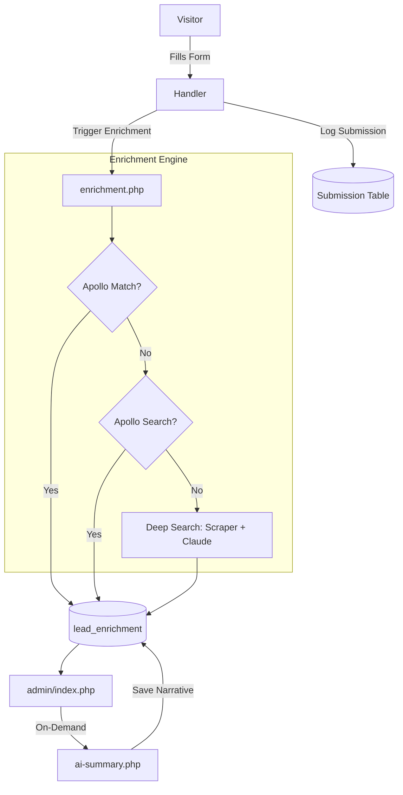

# Prospect Enrichment Flow: From Visitor to Admin Profile

This document details the multi-stage lifecycle of a prospect, from their initial interaction with The Eleanor website to their final enriched profile in the administrative dashboard.

---

## 1. Visitor Tracking & Identity Capture
As a visitor explores the site, their journey is tracked in real-time.
- **Tracking**: `api/track.php` monitors page views and button clicks.
- **Session Identification**: Every visitor is assigned a `tracking_id` which persists across their session and is stored in the `visitor_activity` table.

## 2. Database Persistence
Yes, enrichment data is persisted in a MySQL database. There are three primary tables involved:

- **`visitor_activity`**: Stores real-time behavioral data (clicks, views) linked to a `tracking_id`.
- **`waitlist_submissions`**: Stores raw contact info from general waitlist forms.
- **`unit_inquiries`**: Stores inquiries specifically targeted at individual units.
- **`mailing_list`**: Stores signups for updates and newsletters.
- **`lead_enrichment`**: This is the core intelligence table. It stores:
    - Standard professional data (Title, Company, Industry, Revenue).
    - Social links (LinkedIn, Twitter, etc.).
    - Photos and Company Logos.
    - Identity verification reasoning and confidence scores.
    - AI-generated narrative summaries.
    - The full `raw_response` from the enrichment APIs (Apollo/Scraper) for future reprocessing.

---

## 3. Lead Capture Points
When a visitor interacts with a form, one of three handlers processes the data:

1. **General Inquiry (`api/form-handler.php`)**: Captures standard waitlist data and stores it in `waitlist_submissions`.
2. **Unit-Specific Interest (`api/unit-interest.php`)**: Captures interest in a specific apartment unit and stores it in `unit_inquiries`.
3. **Mailing List (`api/email-list.php`)**: Captures newsletter signups and stores it in `mailing_list`.

Regardless of the entry point, the system immediately links the submission to the visitor's `tracking_id` and triggers the enrichment process.

---

## 3. Intelligent Enrichment (The "Enrichment Engine")
Immediately after storage, `api/enrichment.php` triggers the `enrichLead` process. This is a multi-tier fallback system designed to maximize data quality:

### Tier 1: Apollo.io Direct Match
- **Process**: Attempts to find a direct professional match using the email address.
- **Data Points**: Job title, company, seniority, and social links.

### Tier 2: Apollo.io Search Fallback
- **Trigger**: No direct match found, or location mismatch detected (e.g., phone is US but profile is international).
- **Process**: Searches for the person by name and likely location, then hydrates the best match.

### Tier 3: Deep Search Fallback (Scraper + AI)
- **Trigger**: Apollo fails completely.
- **Step A (Discovery)**: Uses the **Tavily API** to find the most likely LinkedIn URL based on name and area code location.
- **Step B (Extraction)**: Scrapes the full LinkedIn profile via a **LinkedIn Scraper API**.
- **Step C (Normalization)**: Uses **Claude 3 Haiku (Anthropic)** to analyze the raw JSON, verify the identity, and normalize it into a standardized schema (Employment, Education, Company Metrics).

---

## 4. Administrative Intelligence
The enriched data is stored in the `lead_enrichment` table and presented in the `/admin` dashboard.

### Dynamic Grading & Scoring
The dashboard (`admin/index.php`) executes a real-time grading algorithm for every lead:
- **Professional Score**: Weighted points for Seniority (e.g., C-Suite, Director), Company Scale (Revenue/Market Cap), and Elite Education.
- **Engagement Score**: Points added based on the volume of tracking events (web activity).
- **Final Grade**: Categorized from **F** to **A+** based on the total score.

### AI Narrative Summary (On-Demand)
Admins can trigger a **"Generate Prospect Summary"** action.
- **Logic**: `api/ai-summary.php` takes the enrichment data + user activity logs.
- **Synthesis**: Claude 3 Haiku generates a dry, analytical summary focusing on professional reliability, intent, and career trajectory.
- **Storage**: This narrative is persisted to the database for future reference.

---

## 5. Summary of Data Flow
## 6. Profile Reflection (Data Merging)
The **Admin Profile View** (`admin/index.php`) is designed to provide a unified view of the prospect by merging data from two distinct layers:

### The "Intent" Layer
Data is pulled from whichever entry table was used (`waitlist_submissions`, `unit_inquiries`, or `mailing_list`):
- **Source**: Identifies which form they filled out.
- **Context**: Captures specific unit interest, move-in timelines, and budget requirements.

### The "Intelligence" Layer
Data is pulled from the `lead_enrichment` table:
- **Professional Identity**: Job title, company details, and seniority.
- **Social Proof**: Education, board roles, and social media links.
- **AI Narrative**: The synthesized persona based on all available data.

### The "Behavioral" Layer
- **Activity Logs**: All web interactions (page visits, section engagement) are pulled from `visitor_activity` and displayed as a chronological **User Journey**.

By merging these layers, the profile reflects the full context of the prospect: **who they are** (Enrichment), **what they want** (Form Data), and **how interested they are** (Behavioral Logs).

---

## 7. Summary of Data Flow

